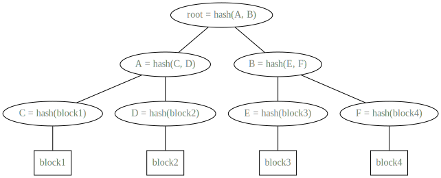
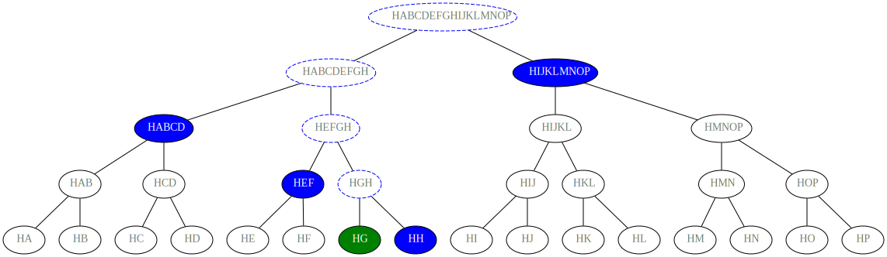

<!--
order: 1
-->

# Concepts

## Merkledrop

Merkledrops are basically airdrop (i.e., [crypto projects sending free tokens to the communities in a bid to encourage adoption](https://www.coindesk.com/learn/what-is-a-crypto-airdrop/)). They are based on the usage of the `Merkle Tree`. Thanks to the features of these data structure (i.e., a binary tree where each _non-leaf_ node is the hash of its childs) they are particularly efficient in space usage and during the verification process (as explained in the [Verification process](#Verification-process)).

A **merkledrop** is characterized by:
| Attribute | Type | Description |
| --------------------- | ---------------------------- | ---------------------------------------------- |
| id | `uint64` | It is an integer that identify the drop. It is assigned automatically by the module. |
| merkle_root | `string` | It should correspond to the _hash root_ of the merkledrop. |
| start_height | `int64` | It is the block height value at which the drop allows the user to claim the tokens. It should be greater or equal to the current block height (the one where the transaction is included) and, if the user pass (as parameter) a value lower than the minimum available, it will be automatically set to the current block height. Moreover, there exists an upper bound for this value, that corresponds to the value of the `actual block height + 100000`. |
| end_height | `int64` | It is the block height value where the _merkledrop_ is considered expired and an automatic withdrawal is executed if part of the tokens were not claimed. This value must be greater than the `start_height` and lower than a maximum value of `start_height + 5000000`. |
| denom | `string` | It corresponds to the `denom` of the token to drop.|
| amount | `string` | It is the total `amount` of token to drop.|
| claimed | `string` | It corresponds to the value of claimed tokens from the users. At the beginning it is 0 and is increased at each claim.|
| owner | `string` | It is to the address of the wallet which is creating the _merkledrop_.|

## Merkle Tree
The Merkle Tree is a data structure discovered by Ralph Merkle in 1979.
In such a tree, every node (aka **leaf**) is labelled with the hash of a data block, and every _non-leaf_ node is labelled with the hash of the of its child nodes. A simple example is depicted in the figure below, while more information can be found on [wikipedia](https://en.wikipedia.org/wiki/Merkle_tree).

## Verification process

The verification process corresponds to check if the proofs received are valid. In this sense, since it is used a merkle tree, it is possible to check whether the proof belongs to the _merkledrop_ without having to deal with all the data that make up the tree.
An exmaple of verification process is depicted in the figure below.

More specifically, in this example, _G_ block of data is provided and, its hash can be simply calculated. Starting from this, it is possible to verify the correctness of the data by only using _4 proofs_, since thanks to these hash values it is possible to calculate the _merkle root_ and compare it with the value saved on the blockchain.
In particular, by calculating HG, together with HH, it is possible to calculate HGH. This value can be used to calculate, together with the proof HEF, the value of HEFGH. This value allows, together with HABCD to calculate HABCDEFGH that, with HIJKLMNOP, allows to determine the merkle root. This value can be compared with the one saved on the blockchain to verify if the user can claim the tokens he says to own. Thanks to this approach, it is possible to save **only the merkle root value on the blockchain** and receive the **proofs by the user**.

This approach works thanks to the features of the hashing functions (in this implementation it is used the [sha-256](https://it.wikipedia.org/wiki/Secure_Hash_Algorithm)). In particular, it plays an important role the avalanche effect (i.e., a small change to the message should correspond to an high change in the hash result).